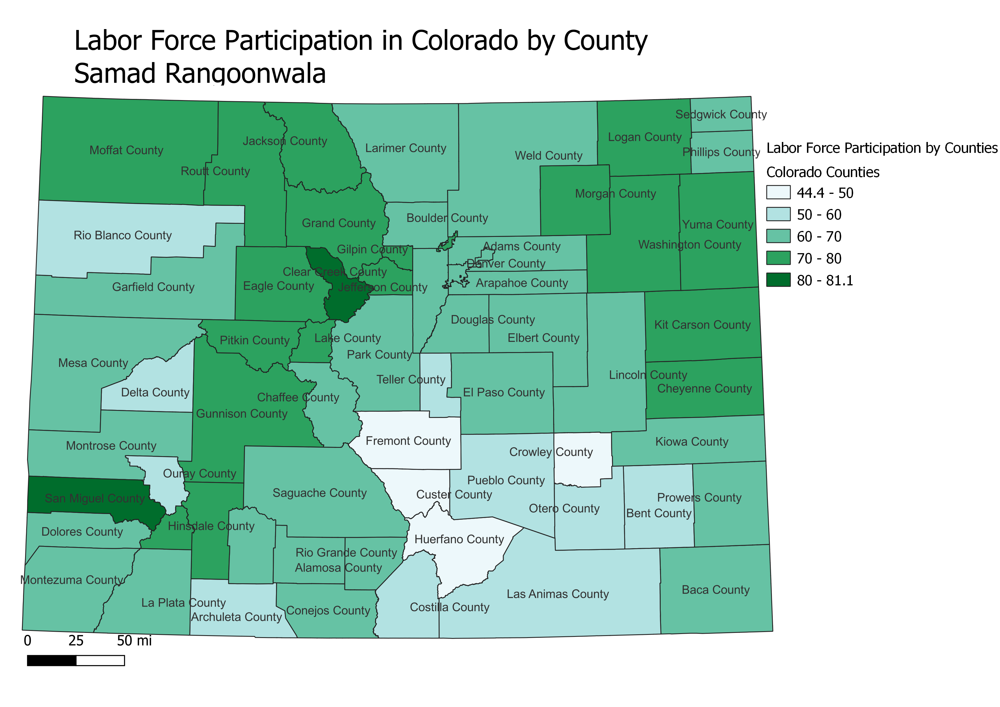

# HW 6
 <!DOCTYPE html>
<html lang="en">
<head>
    <meta charset="UTF-8">
    <meta name="viewport" content="width=device-width, initial-scale=1.0">
    <title>Homework 6</title>
</head>
<body>
<h1>Homework 6: Census data choropleth </h1>
<h2>Samad Rangoonwala</h2>
<h3>Colorado a state in the mountain west region of the US is rocky and rural in the west and flat and agriculural in the east. It's economy is mostly centered around the city of denver, this map shows the labor force particpation by county with a low of 44.43% in Freemont county and a high of 78% in Eagle County. The use of green is do to labor force particpation being a key indicator of economic stablity, green which is associated with money fits.</h3>
<!-- Your map goes here -->

<!-- Link to your shapefile in Github and you CSV -->
<h2>Data used for this project</h2>
    <a href="HW6-CVS.cvs"> CSV dataset </a>
    

    <a href=""CO-County.shp""> Link to shapefile </a>

</body>
</html>
